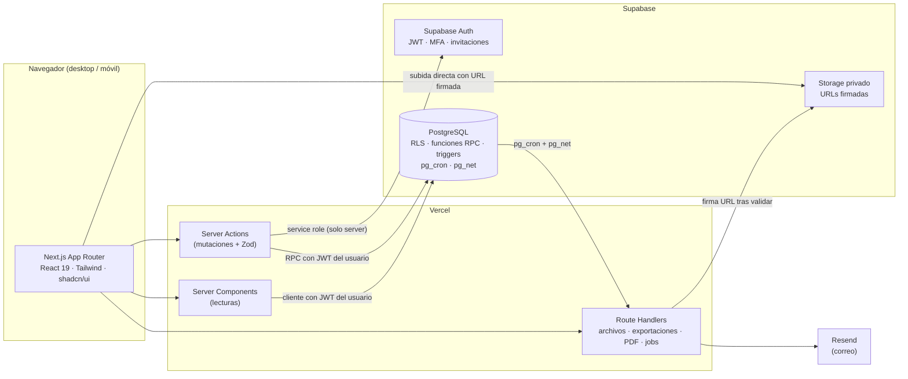

# LMS Grupo TMC: propuesta técnica para aprobación

**Estado:** ✅ **aprobado el 7 de octubre de 2026**, con todas las recomendaciones de la §3. Confirmado el mismo día: **no** se usa la DC-3 (D8) y **no** hay historial en Excel que importar (D9).
**Alcance de este documento:** pasos 1 a 13 de la sección 81 del prompt maestro. Todavía no hay código: se empieza a implementar cuando apruebes esto.

| Documento | Contenido |
|---|---|
| **00-PROPUESTA.md** (este) | Análisis, contradicciones, decisiones, MVP, roadmap y riesgos |
| [ARCHITECTURE.md](ARCHITECTURE.md) | Arquitectura, capas, flujos críticos, estructura de carpetas y jobs |
| [DATABASE.md](DATABASE.md) | ERD, tablas, campos, tipos, índices, FKs, constraints y máquinas de estado |
| [SECURITY.md](SECURITY.md) | Roles, permisos, alcances, políticas RLS, integridad de exámenes y privacidad |

Los demás documentos que pide la sección 78 (API, DEPLOYMENT, TESTING y las guías) se escriben durante la implementación, cuando ya exista lo que describen.

---

## 1. Resumen ejecutivo

- **Una aplicación nueva**, separada del CRM de EA Logística, con su propio proyecto de Supabase. Más adelante se puede unificar el acceso con Microsoft 365, que EA ya tiene conectado.
- **Stack:** Next.js 16 + React 19 + TypeScript + Tailwind 4 en Vercel, y Supabase para Postgres, Auth y Storage. Confirmo el stack que pediste y explico los matices en la §5.
- **Principio rector:** el navegador no es confiable. Las reglas que afectan la integridad académica (intentos, tiempo, calificación, progreso, aprobación y certificados) **viven en la base de datos** como funciones transaccionales. El frontend solo las invoca.
- **Historial inalterable:** cada versión publicada de un curso queda congelada. Cada intento guarda una *fotografía* de las preguntas tal como se presentaron, y la bitácora de auditoría es de solo-agregar y está encadenada con hash.
- **El MVP equivale a los criterios de aceptación de la sección 80.** Recurrencia automática, rutas de aprendizaje, SSO, IA y el resto se programan para la versión 1.1 o la fase 2 (§7).
- **Necesito que decidas 11 puntos** (§3). Para cada uno doy una recomendación, así que puedes aprobarlos en bloque.

---

## 2. Análisis de requerimientos: contradicciones y huecos

### 2.1 Contradicciones o ambigüedades (con la resolución que propongo)

| # | Tema | Problema detectado | Resolución propuesta |
|---|---|---|---|
| C1 | **Configuración duplicada curso/examen** | Las secciones 7 y 10 ponen la calificación mínima, los intentos y el tiempo **en el curso y también en el examen**. | Los parámetros del **examen** son los que mandan. El curso guarda los *valores por defecto* que hereda cada examen nuevo y define la *regla de aprobación del curso* (§41). |
| C2 | **Estados del curso del usuario** | "Pendiente, En progreso, Completado, Aprobado, Reprobado, Vencido" mezclan tres dimensiones distintas: avance, resultado y plazo. Un curso puede estar "en progreso" y "vencido" al mismo tiempo. | Se guardan tres campos: `progress_status` (avance), `result` (sin resultado, en revisión, aprobado o reprobado) y `due_at`. El **estado visible** se *deriva* con una precedencia fija. "Vencido" no se guarda: se calcula, porque así nunca queda desactualizado. Detalle en DATABASE.md §6. |
| C3 | **"Reprobado" con intentos restantes** | Si alguien saca 62 % y le quedan intentos, ¿está reprobado? | No. Queda "En progreso · intento no aprobado". Solo se marca **Reprobado** cuando ya no le quedan intentos (o vence el acceso) sin haber aprobado. |
| C4 | **"Completado" vs "Aprobado"** | La §40 pide distinguir *Visto*, *Completado* y *Aprobado*. | **Visto** = abrió el contenido. **Completado** = cumplió la regla de la lección (tiempo mínimo, % de video, todas las páginas o marcado manual validado). **Aprobado** = cumplió la regla de aprobación del curso. Un curso sin examen termina en *Completado*. |
| C5 | **Fecha límite vs. fecha de expiración** | La §16 pide las dos pero no las distingue. | **Fecha límite**: después de ella el curso aparece *Vencido*, pero el empleado puede seguir si la asignación lo permite. **Expiración**: el acceso se cierra por completo. Ambas se interpretan al final del día (23:59:59) en la zona horaria de la empresa. |
| C6 | **Eliminar cursos** (§4) vs. no borrar datos académicos (§50) | El Super Admin puede "eliminar cursos". | Solo se pueden borrar físicamente los cursos que **nunca tuvieron asignaciones**. Los demás solo se archivan. |
| C7 | **"Publicar/Desactivar examen"** vs. versionado | Si el examen se edita después de publicarse, se rompe el historial. | Los exámenes pertenecen a una **versión** del curso. Lo que se puede cambiar sin crear versión nueva es *operativo*: activo/inactivo y ventana de disponibilidad. El contenido y la calificación solo cambian en una versión nueva. |
| C8 | **Banco de preguntas editable** vs. historial ISO | Si se corrige una pregunta del banco, ¿cambian los exámenes ya presentados? | No. Cada intento guarda una **copia congelada** de las preguntas, opciones y clave tal como se presentaron. Una pregunta que ya se usó no se edita: se crea una *revisión* nueva (`supersedes_id`). |
| C9 | **Selección múltiple con puntaje parcial** | "Cada correcta = 2.5 pts": si se marcan *todas* las opciones, el empleado obtiene el 100 %. | Puntaje parcial = máx(0, aciertos − errores) × (puntos ÷ número de correctas). Marcar todo ya no conviene. |
| C10 | **Pregunta de escala (1-5)** | No tiene respuesta "correcta" natural. | Por defecto **no se califica**: es de opinión y no suma al máximo. Opcionalmente se puede definir un rango correcto. |
| C11 | **Resultado inmediato con preguntas abiertas** | La calificación no es final hasta la revisión manual. | Se muestra como "Calificación preliminar · en revisión". El certificado solo se emite cuando todo quedó calificado. |
| C12 | **Usuarios sin correo** | La §1 pide "usuario/email". Es probable que los operadores no tengan correo corporativo, y Supabase Auth exige email o teléfono. | Se puede entrar con **correo o número de empleado**. A quien no tiene correo se le asigna internamente un correo técnico que nunca se usa para enviar. Su contraseña la restablece un administrador. → **Decisión D1** |
| C13 | **"Ver usuarios de su área"** (Manager) | ¿El área es su departamento o su línea de reporte? | Ver **D4**. |
| C14 | **Instructor de un curso de todo el grupo** | El instructor "ve a los alumnos de sus cursos", pero eso choca con "nadie ve otra empresa sin autorización". | Que sea instructor **cuenta como autorización explícita**, pero limitada a lo que necesita: nombre, número de empleado, empresa, departamento, avance y respuestas de *sus* cursos, sin el resto del perfil. |
| C15 | **La auditoría en la Fase 9** | Si la bitácora se construye al final, todo lo de las fases 1 a 8 queda sin rastro. | La **infraestructura de auditoría va en la Fase 1** (triggers desde el día uno). En la Fase 9 solo se construyen las pantallas de consulta y el expediente ISO. |
| C16 | **El Admin de Capacitación no crea usuarios** | La §1 dice "un administrador puede crear usuarios", pero la §4 solo le permite "ver usuarios". | Respeto la §4 y propongo un rol adicional, **Administrador de RH**, que da de alta usuarios, importa y ve reportes, sin tocar el contenido. Los roles se guardan como datos, así que agregarlo cuesta poco. → **D5** |
| C17 | **Calificación límite 80 %** | Con el redondeo, 79.996 % podría mostrarse como "80 %" y aun así reprobar. | Se redondea a 2 decimales (mitad hacia arriba) **antes** de comparar. Lo que se muestra es exactamente lo que se evaluó. |

### 2.2 Huecos: lo que el prompt no cubre y conviene definir

1. **Constancias DC-3 (STPS).** En México, la capacitación que exige la Ley Federal del Trabajo se acredita con el formato DC-3, que pide CURP, puesto, área temática, horas y agente capacitador. Si quieren que el LMS sirva como evidencia ante la STPS, el certificado debe poder emitirse en ese formato. → **D8**
2. **Aviso de privacidad (LFPDPPP 2025).** El LMS trata datos personales de empleados (foto, teléfono, desempeño). Hay que publicar un aviso de privacidad y minimizar lo que se pide: por ejemplo, la CURP solo si se emite la DC-3.
3. **Historial de capacitación previo.** ¿Existen registros en Excel de cursos ya impartidos? Para la trazabilidad ISO conviene importarlos como "registros históricos" (versión 1.1). → **D9**
4. **Qué pasa cuando alguien cambia de puesto o departamento.** ¿Se le quitan los cursos que recibió por regla? → **D6**
5. **Bajas.** Al desactivar a un empleado se **cancelan** sus asignaciones pendientes (con motivo) y se **conserva** todo lo concluido.
6. **Intentos extra y prórrogas.** El prompt pide reasignar, pero no prevé otorgar *un intento adicional* ni *extender la fecha* a una persona. Lo agrego como **excepciones auditadas** (`enrollment_exceptions`).
7. **Revisión antes de publicar.** El estado REVIEW necesita alguien que revise. Propongo: el instructor envía a revisión y el Admin de Capacitación aprueba y publica. Como opción, "cuatro ojos": quien crea no puede publicar su propio curso.
8. **Enfriamiento entre intentos.** Configurable (por ejemplo, 30 min) para evitar que se responda "a prueba y error".
9. **Identidad visual y firmas** del certificado: logo, firmante y cargo.
10. **Dominio y correo remitente**, por ejemplo `capacitacion.grupotmc.com.mx` y `no-responder@grupotmc.com.mx`. Requiere acceso al DNS. → **D3**

---

## 3. Decisiones que necesito de ti

Cada una trae mi recomendación. Si estás de acuerdo con todas, basta con "apruebo las recomendaciones".

| # | Decisión | Opciones | **Recomendación** |
|---|---|---|---|
| **D1** | ¿Cómo entran los empleados que no tienen correo? | (a) todos con correo · (b) correo **o** número de empleado | **(b)**. A quien no tiene correo, el administrador le entrega una contraseña temporal que se cambia obligatoriamente en el primer acceso. |
| **D2** | Entrar con Microsoft 365 (SSO) | (a) en el MVP · (b) en la 1.1 | **(b) 1.1.** La arquitectura queda lista. Antes hay que confirmar si TMC y TMCa comparten *tenant* de Microsoft con EA. |
| **D3** | Proveedor de correo | (a) Resend con dominio propio · (b) Outlook del usuario, como en el CRM | **(a) Resend.** Supabase Auth necesita SMTP para invitaciones y recuperación de contraseña, y el Outlook delegado no sirve para eso. Hay que dar de alta los registros DNS (SPF y DKIM). |
| **D4** | ¿Qué ve un Jefe/Manager? | (a) su departamento · (b) su línea de reporte (directos e indirectos) · (c) ambos | **(c).** Por defecto ve a toda su línea de reporte. Además se le puede dar alcance explícito sobre uno o varios departamentos o sucursales. |
| **D5** | ¿Quién da de alta usuarios? | (a) solo Super Admin · (b) se agrega el rol **Admin de RH** | **(b).** |
| **D6** | Si un empleado cambia de puesto o departamento y recibió cursos por regla… | (a) se conservan todos · (b) se cancelan los **no iniciados** y se conservan los iniciados o terminados | **(b)**, con motivo en la bitácora. Además recibe automáticamente los cursos de su nuevo puesto. |
| **D7** | Versión nueva de un curso con gente que ya lo aprobó o lo está tomando | Quien está *en progreso* sigue en su versión. Quien ya aprobó **no** repite… | …salvo que, al publicar, el administrador marque **"Requiere recapacitación"**. En ese caso se crea un ciclo nuevo para quienes aprobaron la versión anterior. |
| **D8** | Formato de certificado | (a) constancia interna con QR · (b) además, formato **DC-3** de la STPS | ✅ **Resuelto: solo (a).** No usan la DC-3, así que no se pide la CURP. |
| **D9** | Historial previo en Excel | (a) no hay · (b) importar como registro histórico | ✅ **Resuelto: (a).** No existe un historial formal; el registro empieza con el LMS. |
| **D10** | Presentaciones PPT/PPTX | (a) solo descarga · (b) el instructor sube también el PDF · (c) conversión automática a PDF | **Cambia a (c) en el MVP** (ajuste del 7-oct, §11): el administrador sube el PowerPoint una sola vez y el sistema genera el PDF. Si la conversión falla, puede subir el PDF a mano. *Pendiente de confirmar el servicio de conversión.* |
| **D11** | Infraestructura y costos | Supabase Pro (US$25/mes) + Vercel Pro (US$20/usuario/mes), en proyectos **separados del CRM**, más un proyecto Supabase de desarrollo (gratis) | **Aprobar.** El plan gratuito de Supabase limita los archivos a 50 MB y el almacenamiento a 1 GB, y no tiene respaldos diarios. El plan Hobby de Vercel no permite uso comercial. |
| — | **MFA (doble factor)** para Super Admin y Admin de Capacitación | obligatorio · opcional | **Obligatorio desde el MVP.** Supabase lo da sin costo (TOTP) y la política RLS lo puede exigir. |

---

## 4. Arquitectura propuesta (resumen)

Detalle en [ARCHITECTURE.md](ARCHITECTURE.md).

---

## 5. Decisiones técnicas importantes

| # | Decisión | Por qué |
|---|---|---|
| T1 | **Confirmo Next.js + Supabase + Vercel** | Supabase da Auth, RLS, Storage y cron en un solo servicio administrado, y ya lo operas con el CRM. RLS es la pieza clave del requisito "ningún acceso cruzado entre empresas". |
| T2 | **Es distinto del CRM:** autenticación con Supabase Auth (no la propia con bcrypt) y migraciones **SQL-first** con Supabase CLI (no Drizzle) | Las políticas RLS, las funciones `security definer`, los triggers y pg_cron se expresan de forma natural en SQL. Los tipos de TypeScript se generan desde la base con `supabase gen types`. |
| T3 | **La lógica crítica va en funciones de Postgres** (iniciar intento, guardar respuesta, entregar, calificar, avance, emitir certificado) | Así es **atómica** (todo o nada, con bloqueo de filas que impide intentos duplicados), **usa el reloj del servidor** (`now()`), aplica las reglas **aunque alguien llame a la API directamente** y permite que un job de la base cierre los exámenes cuyo tiempo venció aunque nadie tenga la página abierta. |
| T4 | **RLS como defensa en profundidad + RPC para tableros** | RLS protege cada fila. Para los tableros y reportes con miles de registros, las funciones aplican el alcance del usuario **una sola vez** por consulta y no fila por fila, con paginación del lado del servidor. |
| T5 | **El empleado no tiene permiso de escritura directa** en asignaciones, avance, intentos, respuestas, calificaciones ni certificados | Todo pasa por funciones que validan. Así se cumple literalmente la §62. |
| T6 | **Versionado por `course_versions` + copia congelada por intento** | Lo exigen las §31 y §59: el historial nunca cambia retroactivamente. |
| T7 | **Bitácora de solo-agregar con cadena de hash** | Nadie puede editar ni borrar la bitácora, ni siquiera la aplicación. El hash encadenado permite *demostrar* que nadie la alteró, algo útil ante un auditor ISO. |
| T8 | **Un solo programador de tareas: `pg_cron`** | Cierra intentos vencidos cada minuto, encola recordatorios a diario, genera la foto diaria de cumplimiento y dispara el envío de correos (vía `pg_net` hacia una ruta protegida). No depende del plan de Vercel. |
| T9 | **Archivos: subida directa a Storage** con URL firmada y verificación posterior del tipo real (*magic bytes*) | Vercel limita las peticiones a 4.5 MB, así que un video no puede pasar por el servidor. El bucket es privado y la lectura usa URLs firmadas de corta duración. |
| T10 | **Una sola instalación para el grupo** (no es un SaaS multi-cliente) | Grupo TMC es el único "tenant". Las empresas, sucursales y departamentos son *alcances* dentro de él. Es más simple y seguro. Si algún día se vendiera a terceros, se agregaría una columna `tenant_id`. |
| T11 | **Horas en UTC** (`timestamptz`), mostradas en la zona horaria de la empresa (por defecto `America/Mexico_City`) | Es lo que pide la §55. México ya no tiene horario de verano, pero la librería lo maneja de todos modos. |
| T12 | **Pruebas sin Docker:** Postgres embebido (PGlite) con *shims* de Supabase para probar RLS y funciones, y un proyecto Supabase de desarrollo para las pruebas de extremo a extremo | Tu Mac no tiene Docker. PGlite ya te funcionó en el CRM. Las pruebas de RLS corren en segundos y en CI. |
| T13 | **UI con shadcn/ui (Radix)** | Componentes accesibles (teclado, lectores de pantalla y foco) y con aspecto corporativo sobrio. Cubre la §44 sin reinventar nada. |

---

## 6. MVP (versión 1.0, para el piloto)

El MVP cubre **todos los criterios de aceptación de la §80**. Concretamente:

| Área | Incluye |
|---|---|
| Organización | Empresas, sucursales, departamentos, puestos, grupos de usuarios y configuración global y por empresa |
| Usuarios | Alta individual, invitación por correo, entrada con correo o número de empleado, importación CSV/Excel con validación previa, perfil completo con resumen e historial, estados (activo, inactivo, suspendido, eliminado lógico), roles con alcance y MFA para administradores |
| Cursos | Versiones, máquina de estados, constructor con arrastrar y soltar (módulos, lecciones y contenidos), texto enriquecido sanitizado, PDF, video, imagen, documentos descargables, links, prerrequisitos, obligatorio/opcional/recomendado, duplicar y archivar |
| Avance | Visto / completado / aprobado, tiempo real por lección (*heartbeat* validado por el servidor), avance por módulo y por curso, navegación secuencial configurable |
| Exámenes | Banco de preguntas (categorías, etiquetas, dificultad, tema), los **8 tipos de pregunta**, preguntas fijas y aleatorias ("20 de 50"), mezcla de preguntas y respuestas, tiempo validado en servidor, autoguardado y recuperación, una sola sesión activa por intento, calificación automática y bandeja de calificación manual, políticas de mejor/último/promedio, intentos limitados, enfriamiento y revisión de respuestas |
| Asignaciones | Individual, masiva, por empresa, sucursal, departamento, puesto o grupo y combinaciones, **automática para usuarios futuros**, fecha límite fija o relativa ("N días después del alta"), prórrogas, intentos extra y reasignación con ciclos |
| Tableros | Empleado, Manager, Admin (con "Requiere atención" y actividad reciente), Cumplimiento (semáforo y filtros), ranking de departamentos y vista de Dirección con KPIs. La foto diaria de cumplimiento empieza a acumular historia desde el día uno. |
| Certificados | Constancia PDF con logo, folio único y QR, página pública `/verify/certificate/[código]` y revocación auditada |
| Reportes | Los 10 reportes de la §24 en CSV y Excel. Cumplimiento y expediente de capacitación también en PDF. |
| Notificaciones | En la aplicación y por correo (bienvenida, recuperación, asignación, recordatorios configurables 7/3/1/vencido, aprobado, reprobado, certificado, evaluación pendiente) |
| Auditoría | Bitácora completa desde la Fase 1, visor con filtros e historial por entidad |
| Búsqueda | Búsqueda global por alcance (usuarios, cursos, exámenes, certificados, departamentos) sin distinguir acentos |
| Calidad | Pruebas de RLS, permisos y motor de exámenes, manejo de errores con mensajes claros, datos demo, documentación de la §78 y `.env.example` |

## 7. Lo que queda fuera del MVP

**Versión 1.1 (inmediatamente después del piloto):**
- Recurrencia con **renovación automática** (en el MVP ya se guardan la vigencia y el aviso "renovación requerida"; la 1.1 crea solo el nuevo ciclo)
- SSO con Microsoft 365
- Rutas de aprendizaje (las tablas se diseñan desde ahora)
- IA: generar preguntas desde un PDF o PPTX (siempre en borrador, con revisión humana obligatoria) y sugerir calificación de respuestas abiertas
- Exportaciones asíncronas de más de 50 mil filas
- Detección de sesiones simultáneas a nivel cuenta (en el MVP solo es por intento)

**Fase 2 (futuro, con la arquitectura preparada):** gamificación (puntos, insignias, rankings), competencias, evaluaciones 360° y de desempeño, SCORM/xAPI, API pública con llaves para ERP/CRM/RH, firma electrónica, chatbot, cursos externos, *marketplace* y app móvil (primero como PWA y después con Capacitor).

---

## 8. Roadmap de implementación

Cada fase termina con pruebas en verde, revisión de seguridad y una demo funcionando. El orden respeta la §64 con dos ajustes: la auditoría y las notificaciones internas se adelantan, porque las fases posteriores dependen de ellas.

| Fase | Entregable | Criterio de salida |
|---|---|---|
| **1. Fundación** | Proyecto, Supabase (desarrollo y producción), migraciones de organización, perfiles, roles, permisos, jerarquía, configuración y **auditoría**; Auth (correo o número de empleado, invitación, recuperación, cambio obligatorio y MFA); funciones de alcance y RLS; arnés de pruebas PGlite; *layouts* de empleado y administración; CRUD de organización y usuarios; importación CSV | Un empleado de TMC **no puede** leer nada de EA (prueba automatizada). El Admin crea, invita e importa usuarios. Todo cambio queda en la bitácora. |
| **2. Cursos** | Cursos, versiones, máquina de estados, constructor DnD, contenidos, subida segura, visores (PDF por página y video con %), seguimiento de avance y prerrequisitos | No se puede editar una versión publicada (trigger). El avance cuadra con la regla de cada lección. |
| **3. Exámenes** | Banco, constructor, *pools* aleatorios, motor de intentos (RPC), temporizador, autoguardado, los 8 tipos con calificación automática, bandeja manual y políticas | Matriz de pruebas del motor: tiempo, intentos, sesión duplicada, cada tipo de pregunta y cada política. |
| **4. Asignaciones** | Asignaciones directas, masivas y por regla (incluye usuarios futuros), fechas, vencidos, excepciones, ciclos, bajas y notificaciones internas | Un usuario nuevo que cumple la regla recibe el curso automáticamente. Los vencidos se calculan correctamente en la zona horaria de la empresa. |
| **5. Tableros** | Empleado, Manager, Admin, Cumplimiento, Departamentos y Dirección, más la foto diaria | Los tableros responden en menos de 1 s con 5 000 usuarios y 50 000 asignaciones sintéticas. |
| **6. Certificados** | Plantilla, PDF almacenado con hash, QR, verificación pública y revocación | El QR verifica. Un certificado revocado se muestra como revocado. |
| **7. Reportes** | Los 10 reportes en CSV y Excel, PDF de cumplimiento y expediente | Las exportaciones respetan el alcance del usuario (prueba automatizada). |
| **8. Correo y recordatorios** | Bandeja de salida, Resend, plantillas, reglas configurables y deduplicación | Ningún recordatorio se envía dos veces. Hay reintentos ante fallos. |
| **9. Trazabilidad** | Visor de auditoría, historial por entidad, verificación de la cadena de hash y "Expediente ISO del empleado" | Se contestan con datos las 10 preguntas de la §59 (ver DATABASE.md §8). |
| **10. Endurecimiento y piloto** | Revisión de seguridad, prueba de carga, respaldos (diarios + volcado semanal externo), observabilidad (Sentry), guías de usuario y administrador, y **piloto con un departamento de EA Logística** | Criterios de la §80 cumplidos y piloto sin incidencias críticas. |

---

## 9. Riesgos técnicos

| # | Riesgo | Impacto | Mitigación |
|---|---|---|---|
| R1 | Los límites del plan gratuito de Supabase (archivos de 50 MB, 1 GB en total y sin respaldos) | Alto | Supabase Pro antes de cargar contenido real (D11) |
| R2 | Costo de almacenamiento y transferencia de **videos** | Medio | Límite de tamaño configurable, recomendación de comprimir (720p) y monitoreo del consumo. Si crece, migrar el video a Mux o Cloudflare Stream (la tabla `files` ya lo prevé). |
| R3 | Complejidad y rendimiento de RLS | Alto | Funciones de alcance `stable` con `(select auth.uid())`, tabla de jerarquía precalculada, índices en todas las columnas usadas por las políticas, RPC para tableros y **pruebas automatizadas de cada política** |
| R4 | Las señales de "visto" (página del PDF, % de video) las reporta el navegador y se pueden falsear | Medio | El servidor las acota con el tiempo real transcurrido: no se acepta "90 % de un video de 10 min" con 1 minuto de actividad. Es una limitación inherente a cualquier LMS web y queda documentada. |
| R5 | Una URL firmada de un archivo se comparte mientras está vigente | Bajo | Vigencia corta (10 min en documentos y la duración del video + margen en videos). Las marcas de agua quedan para una fase futura. |
| R6 | Mostrar PPTX/DOCX en el navegador | Medio | D10: el PDF lo sube el instructor en el MVP. En la 1.1, conversión automática con un contenedor Gotenberg (LibreOffice) en Railway o Fly.io, que cuesta unos US$5/mes. |
| R7 | Entrega de correo (spam) | Medio | Dominio propio con SPF, DKIM y DMARC (D3) y bandeja de salida con reintentos |
| R8 | Importar cientos de usuarios topa con el límite de la API de Auth | Bajo | Importación por lotes con progreso y reanudable |
| R9 | Generar PDFs en funciones *serverless* | Bajo | `@react-pdf/renderer` (sin Chromium). El PDF del certificado se genera una vez y se guarda. |
| R10 | **Crecimiento del alcance:** el prompt describe 81 secciones | Alto | MVP estricto (§6). Lo nuevo entra en 1.1 o en la fase 2 salvo que decidas lo contrario. |
| R11 | Dependencia de un solo proveedor (Supabase) | Bajo | Es Postgres estándar: las migraciones SQL y los volcados semanales permiten moverlo a otro Postgres si hiciera falta. |
| R12 | Pruebas de extremo a extremo sin Docker local | Bajo | PGlite para la base y un proyecto Supabase de desarrollo para E2E (T12) |

---

## 10. Siguiente paso

1. Revisa la §3 (decisiones D1 a D11 y MFA) y dime si apruebas las recomendaciones o qué cambias.
2. Con tu aprobación arranco la **Fase 1**: proyecto, migraciones, Auth, RLS con sus pruebas y usuarios.
3. Para la Fase 1 necesitaré que crees **dos proyectos de Supabase** (desarrollo y producción), uno de Vercel y una cuenta de Resend (o que me digas si ya existen), además del logo del grupo. Yo nunca necesito ver contraseñas: las llaves van directo a las variables de entorno.

---

## 11. Ajustes por volumen y sencillez (7 de octubre de 2026)

**Contexto:** se subirán muchas presentaciones y muchos exámenes, habrá más de 170 usuarios y la operación diaria la llevará un administrador, sin ayuda técnica.

### 11.1 Capacidad estimada (Supabase Pro)

| Recurso | Incluido en Pro | Estimado año 1 | Holgura |
|---|---|---|---|
| Usuarios activos al mes | 100,000 | 170 a 300 | Más de 300 veces |
| Archivos | 100 GB | ~11 GB (60 cursos × 3 presentaciones con su PDF ≈ 4 GB, 40 videos ≈ 6 GB, certificados < 1 GB) | ~8 años al mismo ritmo, o ~3 años si el uso se triplica |
| Descargas/visualización al mes | 250 GB | ~25 GB (PDF ≈ 3.5 GB y video ≈ 21 GB) | 10 veces |
| Base de datos | 8 GB | < 0.5 GB (exámenes, respuestas, bitácora) | Más de 15 veces |

Lo que más consume es el **video**, no las presentaciones. Si se pasa del límite, Supabase cobra el excedente por GB: no se bloquea. Costo fijo estimado: Supabase Pro US$25 + Vercel Pro US$20 al mes.

### 11.2 Medidas para cuidar el espacio (se integran a la Fase 2)
- **Panel "Espacio usado"**: "18.4 GB de 100 GB", los archivos más pesados por curso y un aviso al llegar al 80 %.
- **Sin duplicados**: un archivo idéntico, aunque se suba dos veces, se guarda una sola vez (huella sha256).
- **Las versiones no copian archivos**: al actualizar un curso, los archivos que no cambiaron se reutilizan.
- **Videos**: límite configurable de 1 GB por archivo, aviso a partir de 300 MB y recomendación de exportar en 720p.
- **Limpieza automática** de archivos rechazados o huérfanos. Lo que tiene historial académico nunca se borra.

### 11.3 Sencillez para el administrador (se integra a las fases 2 a 4)
- **Asistente de curso en 4 pasos**: Datos → Contenido → Examen → Asignar y publicar. Trae valores por defecto (80 % para aprobar, 3 intentos, 30 minutos), así que solo se cambia lo necesario.
- **Arrastrar y listo**: al soltar varios archivos, cada uno se vuelve una lección, en el orden en que se soltaron. El PowerPoint se convierte solo a PDF (D10).
- **Exámenes desde Excel**: una plantilla para cargar muchas preguntas de una vez (pregunta, opciones, correcta, puntos), con validación previa igual que la de usuarios.
- **Publicar sin pasos extra**: la revisión por una segunda persona queda opcional y apagada por defecto. Las versiones se crean solas al guardar cambios en un curso publicado.
- **Asignación automática por puesto**: la gente nueva recibe sus cursos sin que el administrador intervenga.
- **Menú reducido**: Inicio · Personas · Cursos (incluye exámenes y banco de preguntas) · Asignaciones · Calificar · Reportes. Lo técnico (auditoría, configuración) queda solo para el Super Admin.
- **Un solo administrador**: recibe los roles *Admin de Capacitación* y *Admin de RH*, que juntos le permiten hacerlo todo. El Super Admin queda como respaldo.

