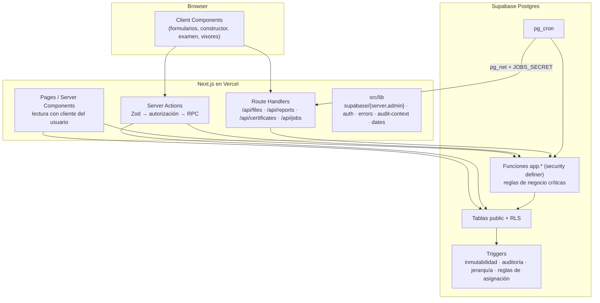
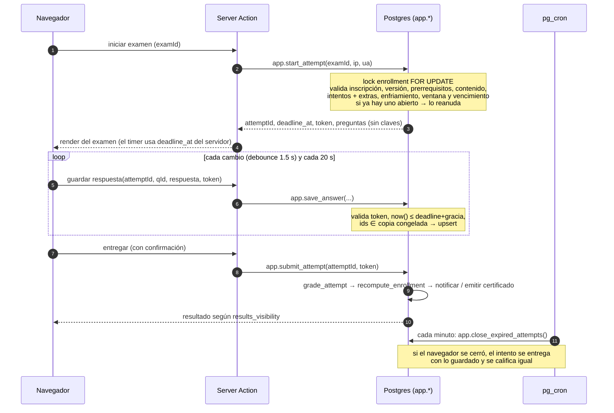
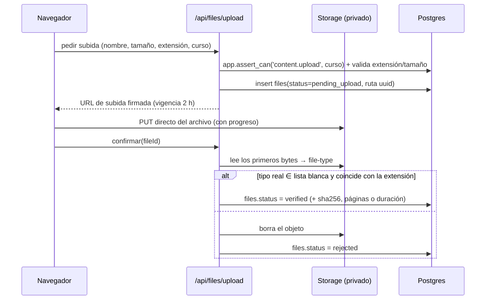

# ARCHITECTURE.md: arquitectura del LMS Grupo TMC

**Estado:** aprobado el 7-oct-2026; la Fase 1 está implementada. Ver también [DATABASE.md](DATABASE.md) y [SECURITY.md](SECURITY.md).

## 1. Stack

| Capa | Tecnología | Uso |
|---|---|---|
| Framework | **Next.js 16** (App Router), **React 19**, **TypeScript** estricto | Server Components para lectura y Server Actions para mutaciones. *Cache Components* (opcional en Next 16) está **apagado**: toda pantalla depende de la sesión. Se reevaluará cuando sea el comportamiento por defecto. |
| Estilos y UI | **Tailwind CSS 4** + primitivas **Radix UI** (diálogos, menús) + **lucide-react** | Componentes propios en `src/components/ui`, accesibles y sobrios. Se descartó copiar shadcn/ui completo para mantener menos dependencias. |
| Formularios | react-hook-form + **Zod 4** (el mismo esquema en cliente y servidor) | |
| Tablas | TanStack Table, con paginación, orden y filtros **del lado del servidor** | |
| Gráficas | Recharts | Tableros |
| Arrastrar y soltar | @dnd-kit | Constructor de cursos y de exámenes |
| Editor de texto | Tiptap, con salida HTML sanitizada | Lecciones y preguntas |
| Visor PDF | pdf.js (`react-pdf`) | Seguimiento por página |
| Base, Auth y Storage | **Supabase** (Postgres 15+, Auth, Storage, `pg_cron`, `pg_net`, `unaccent`, `pg_trgm`) | |
| Cliente de datos | `@supabase/ssr` + `supabase-js` con tipos generados (`supabase gen types`) | |
| Migraciones | **Supabase CLI**, SQL versionado en `supabase/migrations` | |
| Correo | **Resend**: API para correos de la app y SMTP para los de Supabase Auth | |
| PDF | `@react-pdf/renderer` (certificados y reportes) + `qrcode` | |
| Excel/CSV | `exceljs` (en *streaming*) | Reportes e importación |
| Sanitización | `sanitize-html` (servidor) | |
| Tipo de archivo | `file-type` (*magic bytes*) | |
| Fechas | `date-fns` + `date-fns-tz` | Mostrar en la zona horaria de la empresa |
| Pruebas | **Vitest**, **PGlite** (Postgres embebido con *shims* de Supabase) y **Playwright** | |
| Observabilidad | Sentry (errores) + logs de Vercel + `/api/health` | |
| Hosting | **Vercel** (app) + **Supabase** (datos) | |

## 2. Capas y patrones de acceso a datos



Hay cuatro patrones, y cada operación usa exactamente uno:

| # | Patrón | Cuándo | Quién autoriza |
|---|---|---|---|
| P1 | **Lectura con el cliente del usuario** (JWT) | Páginas y listas | RLS |
| P2 | **Escritura directa con el cliente del usuario** | CRUD administrativo de bajo riesgo: borradores de cursos, módulos, lecciones, banco de preguntas, catálogos | RLS + CHECK + triggers (inmutabilidad y auditoría) |
| P3 | **RPC `security definer`** | Todo lo crítico: intentos, respuestas, calificación, avance, asignaciones, transiciones de estado, roles, usuarios, certificados, tableros y reportes | La función valida `app.can(...)` y las reglas, todo dentro de una transacción |
| P4 | **Service role (solo servidor)** | Lo que la base no puede hacer: crear o banear usuarios en Auth, firmar URLs de Storage, enviar correos y generar PDFs | La Server Action llama primero a una RPC de autorización (`app.assert_can`) y solo después usa la service role |

**Regla:** si una operación cambia algo académico (avance, intentos, calificaciones, fechas o certificados), va por P3. No hay excepciones.

## 3. Estructura de carpetas

```
lms-grupo-tmc/
├── supabase/
│   ├── config.toml
│   ├── migrations/                 # SQL versionado (orden numérico)
│   │   ├── 0001_extensions_schemas.sql
│   │   ├── 0002_enums.sql
│   │   ├── 0003_org_identity.sql
│   │   ├── 0004_rbac_scope_functions.sql
│   │   ├── 0005_audit.sql
│   │   ├── 0006_files_settings.sql
│   │   ├── 0007_courses_versions.sql
│   │   ├── 0008_question_bank_exams.sql
│   │   ├── 0009_enrollments_progress.sql
│   │   ├── 0010_attempt_engine.sql
│   │   ├── 0011_certificates.sql
│   │   ├── 0012_notifications_outbox.sql
│   │   ├── 0013_dashboards_reports.sql
│   │   ├── 0014_rls_policies.sql
│   │   └── 0015_cron_jobs.sql
│   ├── seed/                       # demo (solo desarrollo) y base (producción)
│   └── tests/                      # pruebas SQL de RLS y funciones
├── src/
│   ├── app/
│   │   ├── (auth)/                 # entrar, recuperar, restablecer, invitacion, cambiar-contrasena, mfa
│   │   ├── (empleado)/             # layout móvil primero
│   │   │   ├── page.tsx            # Inicio: "Hola, Nombre"
│   │   │   ├── cursos/             # Mis cursos · [enrollmentId] · leccion/[lessonId]
│   │   │   ├── examen/[attemptId]/ # presentación del examen
│   │   │   ├── en-progreso/  completados/  certificados/
│   │   │   ├── perfil/  notificaciones/
│   │   ├── admin/                  # layout de escritorio; el menú se filtra por permisos
│   │   │   ├── page.tsx            # Home: "Buenos días" · Requiere atención · actividad
│   │   │   ├── direccion/  cumplimiento/  departamentos/
│   │   │   ├── usuarios/ (importar/, [id]/)
│   │   │   ├── organizacion/ (empresas, sucursales, departamentos, puestos, grupos)
│   │   │   ├── cursos/ ([id]/constructor, [id]/versiones)
│   │   │   ├── banco-preguntas/  examenes/
│   │   │   ├── asignaciones/  calificaciones/  certificados/
│   │   │   ├── reportes/  notificaciones/  auditoria/  configuracion/
│   │   ├── verify/certificate/[code]/   # pública (ruta pedida en la §20)
│   │   └── api/
│   │       ├── files/[id]/url/          # URL firmada tras autorizar
│   │       ├── files/upload/            # emite URL de subida + verifica después
│   │       ├── reports/[report]/        # CSV/XLSX/PDF en streaming
│   │       ├── certificates/[id]/pdf/
│   │       ├── jobs/[job]/              # llamados por pg_cron (JOBS_SECRET)
│   │       └── health/
│   ├── features/                   # un módulo por dominio
│   │   ├── org/  users/  auth/  courses/  content/  progress/
│   │   ├── questions/  exams/  attempts/  grading/  assignments/
│   │   ├── dashboards/  certificates/  reports/  notifications/
│   │   ├── audit/  search/  settings/
│   │   │   └── (cada uno) actions.ts · queries.ts · schemas.ts · components/ · *.test.ts
│   ├── components/
│   │   ├── ui/                     # shadcn/ui
│   │   └── layout/                 # shells, menú, encabezado, buscador global
│   ├── lib/
│   │   ├── supabase/ server.ts · client.ts · admin.ts (server-only)
│   │   ├── auth/ session.ts · guards.ts (requirePermission)
│   │   ├── errors.ts               # código técnico → mensaje en español
│   │   ├── audit-context.ts        # IP, UA y request_id hacia la base
│   │   ├── dates.ts                # zona horaria por empresa
│   │   ├── sanitize.ts  rate-limit.ts  files.ts
│   └── types/database.ts           # generado
├── tests/
│   ├── db/                         # Vitest + PGlite: RLS, RPC y motor de exámenes
│   ├── unit/
│   └── e2e/                        # Playwright contra el proyecto de desarrollo
├── docs/
├── .env.example
└── README.md
```

URLs de la app en español y código en inglés, igual que en el CRM.

## 4. Flujos críticos

### 4.1 Examen: inicio, autoguardado, entrega y cierre por tiempo



Las respuestas pendientes de guardar también se conservan en `localStorage` como respaldo de la conexión: si se cae y vuelve, se reenvían. El servidor es siempre la fuente de verdad.

### 4.2 Avance de una lección

1. Al abrir: `app.track_lesson(lessonId, 'open')` marca la lección como `viewed`. Si la inscripción no había empezado, **fija la versión** (`course_version_id`) y marca `started_at`.
2. Cada 20 s, con la pestaña visible: `app.track_lesson(lessonId, 'heartbeat', {page, videoPct})`. El servidor suma `least(now() - last_heartbeat_at, 60s)` a `seconds_spent` y acota el `video_pct` reportado según el tiempo real.
3. "Marcar como completado", o completado automático según la regla: `app.complete_lesson(lessonId)` valida la regla (`min_time`, `video_percent`, `all_pages` o `manual`, que exige haberla visto) → recalcula el avance → audita.
4. Si la versión es `sequential`, el servidor **niega** abrir la lección N+1 mientras la N obligatoria no esté completada. No basta con ocultar el botón en el navegador.

### 4.3 Subida de archivos



### 4.4 Asignación por regla (incluye usuarios futuros)

- Al crear la asignación: `app.create_assignment()` inserta la orden y, en lotes, crea las inscripciones de quienes cumplen los criterios hoy, saltándose a quien ya tiene una activa.
- Al **dar de alta** a un usuario o **cambiarlo** de empresa, sucursal, departamento o puesto, un trigger llama a `app.apply_rules_for_user(user)`: crea las inscripciones de las reglas con `include_future_users` y, según D6, cancela las no iniciadas que ya no le correspondan.
- Fecha relativa: `due_at = fecha de inscripción + due_in_days`, al final del día en la zona horaria de la empresa.
- Todo se notifica (en la app y por correo) y queda auditado.

### 4.5 Certificado

1. Al aprobar, `recompute_enrollment` llama a `app.issue_certificate(enrollment)`: folio consecutivo con bloqueo de fila, código de verificación aleatorio, copias de nombre, curso e instructor, y `expires_at`. Encola la notificación.
2. La primera vez que se descarga, `/api/certificates/[id]/pdf` genera el PDF con `@react-pdf/renderer` (logo, datos y QR → `/verify/certificate/<código>`), lo guarda en el bucket `certificates` y registra `pdf_sha256`. Las descargas siguientes entregan ese mismo archivo.
3. `/verify/certificate/[code]` llama a la RPC pública `verify_certificate(code)` (con *rate limit*) y muestra si es válido, expirado o revocado.

### 4.6 Correo (outbox)

La app **nunca** envía un correo dentro de la transacción del negocio. Inserta una fila en `email_outbox` con su `dedupe_key`, y un job toma un lote (`FOR UPDATE SKIP LOCKED`), lo envía con Resend y marca el resultado. Si falla, reintenta con espera exponencial hasta 5 veces. Así, si Resend falla, no se pierde nada ni se duplica nada.

Los correos de Auth (invitación y recuperación) los envía Supabase Auth por el SMTP de Resend, con plantillas en español.

## 5. Contexto de auditoría

Las Server Actions crean el cliente de Supabase con encabezados globales: `x-request-id`, `x-client-ip` y `x-client-ua`. PostgREST los expone a la base en `current_setting('request.headers')`, y la función `app.log()` y los triggers de auditoría los leen. Así cada fila de la bitácora tiene actor (de `auth.uid()`), IP, *user agent* y `request_id`, sin que el código de cada acción tenga que acordarse de pasarlos.

Las operaciones con service role (P4) ponen `app.actor_id` con `set_config` dentro de la RPC que las acompaña, de modo que nunca queda una acción sin autor.

## 6. Jobs programados (`pg_cron`)

| Job | Frecuencia | Qué hace |
|---|---|---|
| `close_expired_attempts` | cada minuto | Entrega y califica los intentos cuyo tiempo venció |
| `dispatch_outbox` | cada 2 min | `pg_net` → `POST /api/jobs/outbox` (envía correos pendientes) |
| `enqueue_reminders` | diario 08:00 (hora de la empresa) | Aplica `reminder_rules` a las inscripciones activas; la deduplicación evita repetir |
| `notify_overdue` | diario 08:05 | Avisa al empleado y a su jefe de lo que venció ayer |
| `compliance_snapshot` | diario 01:00 | Foto diaria para las gráficas de evolución |
| `renewals` (1.1) | diario | Crea el ciclo de renovación `renewal_lead_days` antes de `valid_until` |
| `cleanup_files` | semanal | Borra de Storage los archivos `rejected` o huérfanos de más de 7 días |
| `verify_audit_chain` | semanal | Verifica la cadena de hash y alerta si se rompe |

## 7. Manejo de errores

- Las RPC lanzan errores con **códigos propios** (`ATTEMPT_EXPIRED`, `NO_ATTEMPTS_LEFT`, `PREREQUISITE_MISSING`, `INVALID_TRANSITION`, `FORBIDDEN`, `SESSION_CONFLICT` y otros) mediante `raise exception using errcode = 'P0001', message = 'NO_ATTEMPTS_LEFT'`.
- `src/lib/errors.ts` traduce los códigos propios y los de Postgres (`23505` con el nombre de la restricción, `23503`, `42501`) a mensajes claros en español. Lo que no está mapeado se muestra como "Ocurrió un problema. Código de referencia: abc123" y se reporta a Sentry con el `request_id`.
- Las Server Actions devuelven `{ ok: true, data } | { ok: false, error: { code, message, fieldErrors? } }` y nunca lanzan errores al cliente.

## 8. Rendimiento y escalabilidad

- **Nada de listas completas en el cliente.** Toda tabla se pagina en el servidor (keyset en las grandes) con filtros y orden en SQL.
- Los tableros se calculan con **RPC agregadas** que filtran por alcance una sola vez, con índices adecuados. Las gráficas históricas usan `compliance_snapshots`, y no recalculan el pasado.
- Server Components con *streaming* y `Suspense` por tarjeta: el tablero muestra cada KPI en cuanto está listo.
- Las imágenes van por `next/image` con tamaños fijos. Los videos se sirven directo desde Storage (CDN) con `Range`, así que no pasan por Vercel.
- Las exportaciones grandes se generan en *streaming*, con lectura por páginas de 1 000 filas. Hasta 50 000 filas se exporta en línea; más que eso irá a un job en la 1.1.
- Conexiones: el cliente REST de Supabase (PostgREST) evita el problema del *pooler* que vivió el CRM, porque la app no abre conexiones directas a Postgres.
- Antes de cerrar la Fase 5 se hace una prueba de carga con datos sintéticos (5 000 usuarios y 100 000 inscripciones).

## 9. Ambientes y variables

| Ambiente | Supabase | Vercel | Datos |
|---|---|---|---|
| Desarrollo | Proyecto `lms-dev` (plan gratuito) | `next dev` / *previews* | Datos demo de la §67 |
| Producción | Proyecto `lms-prod` (Pro) | Proyecto `lms-grupo-tmc` (Pro) | Solo la estructura de organización, la configuración y una invitación al Super Admin |

`.env.example` (se crea en la Fase 1):

```
NEXT_PUBLIC_SUPABASE_URL=
NEXT_PUBLIC_SUPABASE_ANON_KEY=
SUPABASE_SERVICE_ROLE_KEY=          # solo servidor
NEXT_PUBLIC_APP_URL=                # https://capacitacion.grupotmc.com.mx
APP_ENV=                            # development | production
RESEND_API_KEY=
EMAIL_FROM=                         # "Capacitación Grupo TMC <no-responder@...>"
JOBS_SECRET=                        # lo usa pg_cron/pg_net para llamar /api/jobs/*
SENTRY_DSN=
INTERNAL_EMAIL_DOMAIN=users.lms.internal   # correos técnicos de quien no tiene correo (D1)
```

## 10. Superficie de API (para API.md)

**Server Actions y RPC por dominio** (cada una con Zod, permiso requerido, códigos de error y evento de auditoría, documentados en API.md):

| Dominio | Operaciones |
|---|---|
| Auth | `signIn` (correo o número), `signOut`, `requestPasswordReset`, `updatePassword`, `enrollMfa`, `verifyMfa` |
| Users | `createUser`, `updateUser`, `setUserStatus`, `grantRole`, `revokeRole`, `previewImport`, `commitImport`, `resetPasswordForUser` |
| Org | CRUD de empresas, sucursales, departamentos, puestos y grupos |
| Courses | CRUD de borradores, `transitionCourse`, `createVersion` (clonar), `duplicateCourse`, `reorder` |
| Content | `requestUpload`, `confirmUpload`, `getFileUrl` |
| Progress | `trackLesson`, `completeLesson` |
| Questions | CRUD, `reviseQuestion`, `importQuestions` (CSV) |
| Exams | CRUD, `duplicateExam`, `setExamActive` |
| Attempts | `startAttempt`, `saveAnswer`, `submitAttempt`, `takeoverSession`, `voidAttempt` |
| Grading | `listPendingReviews`, `gradeAnswer`, `overrideGrade` |
| Assignments | `createAssignment`, `previewAudience` ("se asignará a 84 personas"), `deactivateAssignment`, `grantException`, `reassign`, `cancelEnrollment` |
| Certificates | `getCertificatePdf`, `revokeCertificate`, `verifyCertificate` (pública) |
| Reports | `runReport(type, filtros, página)`, `exportReport(type, formato)` |
| Notifications | `listMine`, `markRead`, `markAllRead`, CRUD de reglas |
| Audit | `searchAudit`, `entityHistory`, `verifyChain` |
| Search | `globalSearch(q, tipos)` |

**API pública versionada** (`/api/v1/*` con llaves por integración) para ERP, CRM y RH: fase 2. La separación `features/*/queries.ts` permite exponerla sin reescribir la lógica.

## 11. Preparado para el futuro (sin construirlo ahora)

| Futuro | Qué queda listo desde el MVP |
|---|---|
| SSO Microsoft/Google | Supabase Auth soporta Azure y Google. `profiles` se liga por correo, y `auth_email` separa la identidad del correo de contacto. |
| Rutas de aprendizaje | Tablas `learning_paths` y `learning_path_steps` + prerrequisitos ya implementados |
| Gamificación | Toda la actividad queda registrada (bitácora y avance). Puntos e insignias serían tablas nuevas alimentadas por esos eventos. |
| Competencias / 360 | `positions` + cursos → la matriz `position_competencies` se agrega sin tocar lo existente |
| SCORM / xAPI | `content_type` es extensible (`scorm_package`). `lesson_progress.resume_state jsonb` guarda el estado del runtime. Los eventos se pueden emitir como *statements* xAPI desde la bitácora. |
| IA para preguntas | `questions.source = ai_draft` + `ai_review_status`. Publicar exige la aprobación humana. |
| IA para respuestas abiertas | `manual_grades.ai_suggested_pct` / `ai_rationale`. La calificación final siempre la pone una persona. |
| App móvil | La interfaz del empleado está diseñada primero para móvil. PWA en la 1.1 y Capacitor después, como en Momentum. |
| Cursos externos / marketplace | `courses.visibility` y `owner_company_id` permiten catálogos. Los proveedores externos serían un tipo de instructor. |
