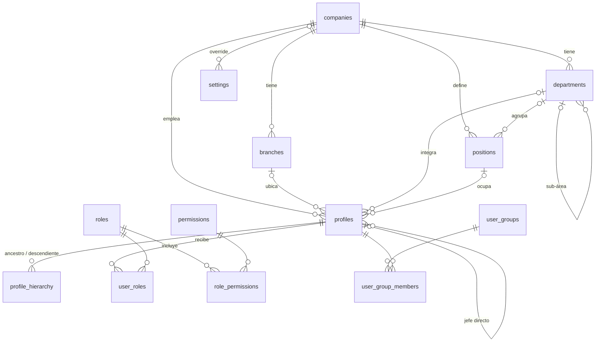
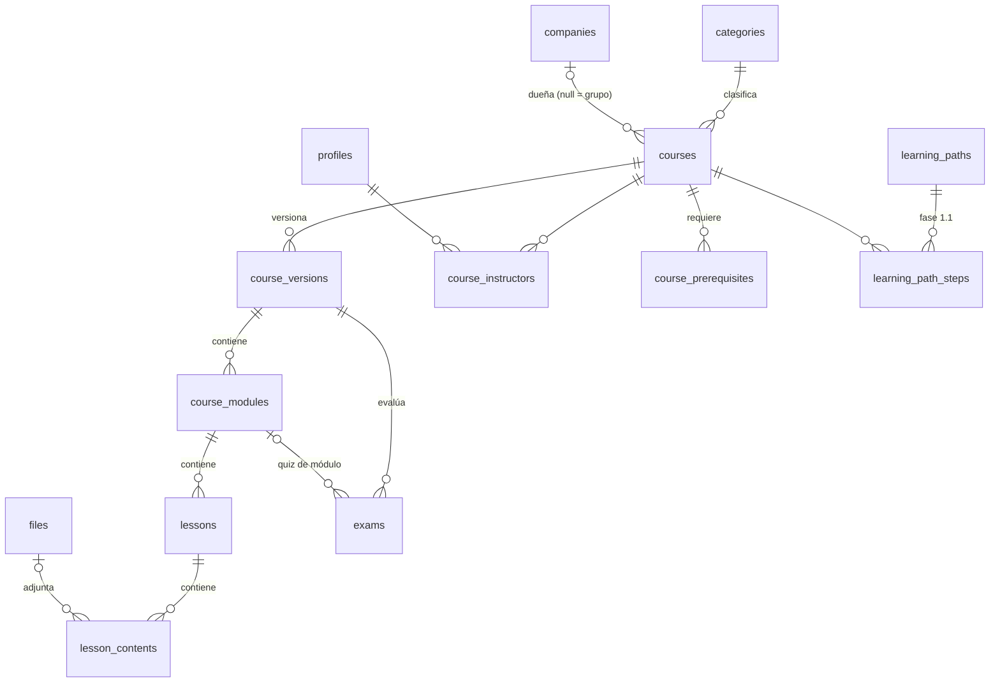
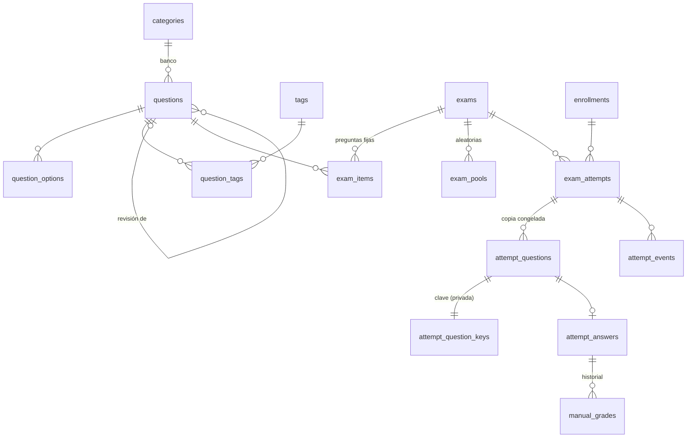
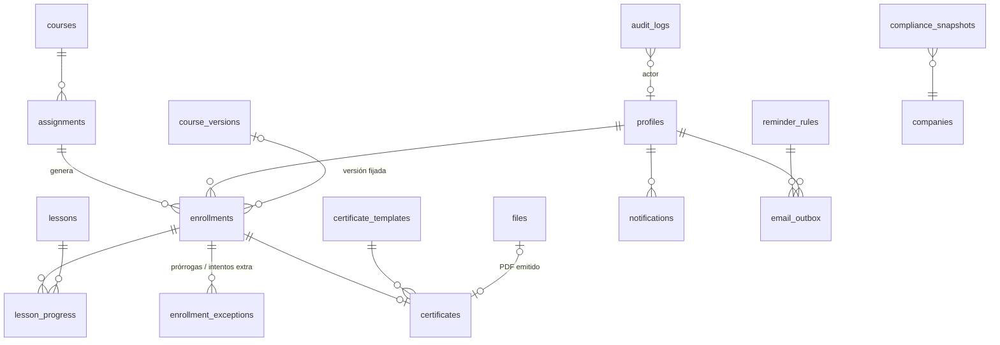
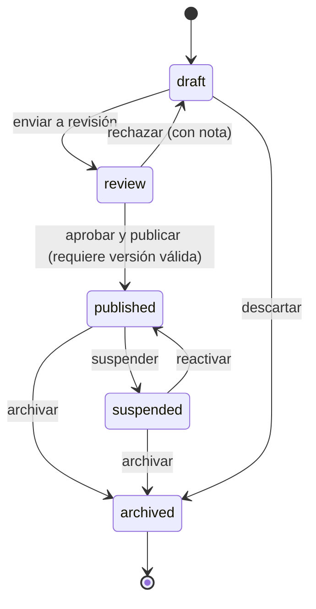
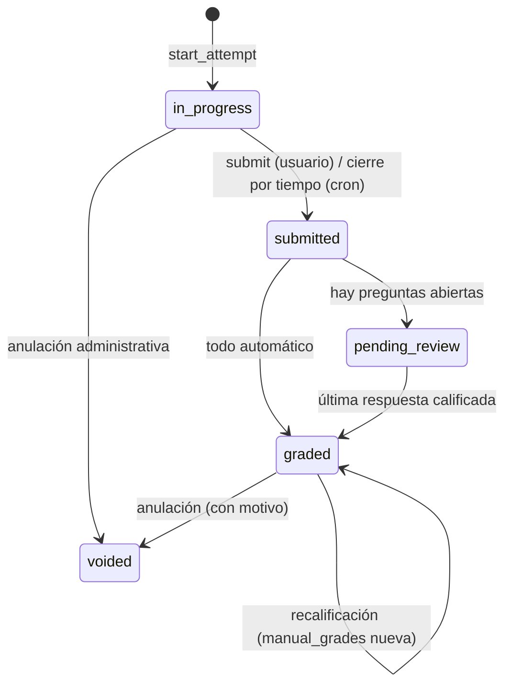

# DATABASE.md: modelo de datos

**Estado:** diseño para aprobación. Las migraciones SQL se escriben al iniciar la Fase 1.
Motor: PostgreSQL 15+ (Supabase). Las políticas RLS están en [SECURITY.md](SECURITY.md).

## 1. Convenciones

| Tema | Regla |
|---|---|
| Llaves | `id uuid primary key default gen_random_uuid()`. La bitácora usa `bigint identity` para conservar el orden de inserción. |
| Tiempos | `created_at` y `updated_at` como `timestamptz not null default now()`. `updated_at` se mantiene con un trigger. Todo se guarda en UTC. |
| Autoría | `created_by uuid references profiles(id)` en las entidades administrativas |
| Borrado | **Lógico** (`deleted_at`, `deleted_by`) en usuarios, cursos, preguntas y archivos. **Nunca** se borra un registro académico (asignaciones, intentos, respuestas, calificaciones o certificados): se *cancelan*, *anulan* o *revocan* con motivo. |
| Estados | Tipos `enum` de Postgres (generan tipos de TypeScript exactos) |
| Dinero/puntos | `numeric(7,2)` para puntos y `numeric(5,2)` para porcentajes de 0 a 100, con `CHECK` de rango |
| Texto con búsqueda | Extensiones `unaccent` y `pg_trgm`. Índices GIN trigram sobre nombres y títulos. |
| Esquemas | `public`: tablas que expone la API (siempre con RLS). `app`: funciones internas y tablas privadas, como las claves de respuestas, **no** expuestas por la API. `audit`: bitácora, no expuesta. |
| Nombres | Tablas y columnas en inglés (`snake_case`) y textos de la interfaz en español. Las URLs de la app van en español. |

### Equivalencias con los nombres del prompt (§30)

| Prompt | Este diseño | Motivo |
|---|---|---|
| `users` | `auth.users` (Supabase) + `profiles` | Supabase administra las credenciales. `profiles.id = auth.users.id`. |
| `course_assignments` | `assignments` (la *orden*: a quién y con qué fechas) + `enrollments` (*la inscripción de una persona*) | Una asignación por regla genera muchas inscripciones, incluidas las de usuarios futuros. |
| `assignment_groups` | `user_groups` + `user_group_members` | Grupos *ad hoc* que se usan como destino de una asignación |
| `course_progress` | Columnas de `enrollments` + la vista `v_module_progress` | El avance del curso es 1:1 con la inscripción. Una tabla aparte solo duplicaría datos. |
| `answers` | `attempt_answers` | |
| `lesson_content` | `lesson_contents` | |
| `manual_grades` | `manual_grades` (histórico, solo-agregar) | |

---

## 2. ERD

### 2.1 Organización e identidad



### 2.2 Cursos y contenido



### 2.3 Exámenes e intentos



### 2.4 Asignación, avance, certificados, notificaciones y auditoría



---

## 3. Tablas

Notación: **PK** llave primaria · **FK** llave foránea · **U** único · `?` admite nulo. Las columnas comunes (`id`, `created_at` y `updated_at`) se omiten salvo cuando importan.

### 3.1 Organización

**companies**
| Campo | Tipo | Notas |
|---|---|---|
| name | text | U |
| short_name | text | Por ejemplo "EA", "TMC" o "TMCa" |
| legal_name | text? | Razón social |
| rfc | text? | Dato fiscal de la empresa (opcional) |
| logo_file_id | uuid? FK files | |
| timezone | text | default `'America/Mexico_City'` |
| primary_color | text? | `#RRGGBB` (CHECK regex) |
| is_active | boolean | default true |
| deleted_at | timestamptz? | |

**branches**: `company_id` FK, `name`, `code`, `city?`, `state?`, `timezone?` (si es nulo hereda la de la empresa), `is_active`. **U** `(company_id, code)`. Índice `(company_id)`.

**departments**: `company_id` FK, `parent_id?` FK departments (sub-áreas), `name`, `code`, `functional_area?` (texto común entre empresas, por ejemplo "operaciones", que permite comparar "Operaciones" de EA con la de TMC), `head_user_id?` FK profiles, `is_active`. **U** `(company_id, code)`. Trigger anti-ciclos en `parent_id`.

**positions** (puestos): `company_id` FK, `department_id?` FK, `name`, `code`, `is_active`. **U** `(company_id, code)`.

**user_groups**: `name`, `description?`, `company_id?` (nulo = de grupo), `created_by`. **user_group_members**: PK `(group_id, user_id)` y `added_by`, `added_at`.

### 3.2 Identidad y perfil

**profiles** (1:1 con `auth.users`)
| Campo | Tipo | Notas |
|---|---|---|
| id | uuid PK FK auth.users | `on delete restrict`: el usuario de Auth no se borra, se *banea* |
| employee_number | text? | **U** `(company_id, employee_number)` |
| username | text? | **U** `lower(username)`. Se usa para entrar sin correo. |
| first_name | text | not null |
| last_name_paternal | text | not null |
| last_name_maternal | text? | |
| email | text? | Correo real. **U** `lower(email)` donde no es nulo. |
| auth_email | text | Correo con el que entra a Auth: el real o `num.empresa@users.lms.internal` |
| has_real_email | boolean | false = no se le envían correos |
| phone | text? | |
| company_id | uuid FK | not null |
| branch_id | uuid? FK | CHECK: la sucursal es de la misma empresa (trigger) |
| department_id | uuid? FK | ídem |
| position_id | uuid? FK | ídem |
| manager_id | uuid? FK profiles | Trigger anti-ciclos. Mantiene `profile_hierarchy`. |
| hire_date | date? | Base de las fechas límite relativas |
| status | `user_status` | `active`, `inactive`, `suspended`, `deleted` |
| photo_file_id | uuid? FK files | |
| must_change_password | boolean | default false |
| mfa_required | boolean | Se calcula a partir de sus roles |
| last_login_at | timestamptz? | |
| status_changed_at / status_reason | | |
| deleted_at / deleted_by | | El historial académico **se conserva** |
| search | tsvector GENERATED | Nombre, apellidos, número de empleado y correo, sin acentos |

Índices: `(company_id, status)`, `(department_id)`, `(branch_id)`, `(position_id)`, `(manager_id)`, GIN `(search)` y GIN trigram sobre el nombre completo.

**profile_hierarchy** (cierre transitivo de la línea de reporte): PK `(ancestor_id, descendant_id)`, `depth int`. Índice `(descendant_id)`. La mantiene un trigger al cambiar `manager_id`. Permite que "todos los subordinados de X" sea una búsqueda indexada, sin recursión en cada política RLS.

**roles**: `key` U (`super_admin`, `training_admin`, `hr_admin`, `manager`, `instructor`), `name`, `description`, `is_system`.
**permissions**: `key` PK (por ejemplo `courses.publish`), `category` y `description`. El catálogo está en SECURITY.md §2.
**role_permissions**: PK `(role_id, permission_key)`.
**user_roles**
| Campo | Tipo | Notas |
|---|---|---|
| user_id | FK profiles | |
| role_id | FK roles | |
| scope_type | `scope_type` | `group`, `company`, `branch`, `department`, `team` |
| scope_id | uuid? | Nulo solo con `group` o `team` (CHECK) |
| granted_by / granted_at | | |
| expires_at | timestamptz? | Roles temporales |
| revoked_at / revoked_by | | Nunca se borra: se revoca |

**U** parcial `(user_id, role_id, scope_type, coalesce(scope_id, '0…'))` donde `revoked_at is null`. Índice `(user_id) where revoked_at is null`.

### 3.3 Catálogos, archivos y configuración

**categories**: `kind` (`course` | `question`), `name`, `parent_id?`, `slug`. **U** `(kind, slug)`.
**tags**: `name` (U, minúsculas). **question_tags**: PK `(question_id, tag_id)`.

**files**
| Campo | Tipo | Notas |
|---|---|---|
| bucket | text | `course-content`, `avatars`, `certificates`, `imports`, `branding` |
| storage_path | text | **U** `(bucket, storage_path)`. Ruta generada por el servidor (uuid) y nunca por el usuario. |
| original_name | text | Sanitizado |
| extension | text | CHECK contra la lista blanca |
| mime_type | text | El **detectado** por *magic bytes*, no el declarado |
| size_bytes | bigint | CHECK > 0 |
| sha256 | text? | Integridad y deduplicación |
| status | `file_status` | `pending_upload`, `verified`, `rejected` |
| version | int | default 1 |
| previous_version_id | uuid? FK files | Versionado de archivos |
| media_duration_s | int? | Videos: sirve para validar el % visto |
| page_count | int? | PDF: sirve para "todas las páginas" |
| uploaded_by | FK profiles | |
| course_id | uuid? FK | Contexto (§9 del prompt). Módulo y lección se obtienen vía `lesson_contents`. |
| deleted_at | | Borrado lógico. El objeto en Storage solo se elimina con un job de limpieza si **nada** lo referencia. |

**settings**: `key` text, `company_id?` FK (nulo = global), `value jsonb` (validado con Zod en la app), `updated_by`. **U** `(key, coalesce(company_id,'0…'))`. Claves: `branding`, `locale`, `date_format`, `defaults.passing_score`, `defaults.max_attempts`, `defaults.time_limit_minutes`, `certificates`, `uploads.limits`, `security.session`, entre otras.

### 3.4 Cursos

**courses** (la identidad estable del curso)
| Campo | Tipo | Notas |
|---|---|---|
| code | text | **U**. Por ejemplo `SEG-001`. |
| title | text | Título vigente |
| description | text? | |
| cover_file_id | uuid? FK files | |
| category_id | uuid? FK categories | |
| owner_company_id | uuid? FK | **Nulo = curso de todo el grupo** |
| owner_department_id | uuid? FK | |
| status | `course_status` | `draft`, `review`, `published`, `suspended`, `archived`. **Solo cambia vía RPC** (§5). |
| current_version_id | uuid? FK course_versions | La versión publicada vigente |
| default_requirement | `requirement_level` | `mandatory`, `recommended`, `optional` |
| visibility | `course_visibility` | `assigned_only` (por defecto) o `catalog` (autoinscripción) |
| estimated_minutes | int? | |
| issues_certificate | boolean | |
| certificate_template_id | uuid? FK | |
| validity_months | int? | Recurrencia: 1, 3, 6, 12 o personalizado. Nulo = no vence. |
| renewal_lead_days | int? | Cuántos días antes de vencer se abre la renovación (1.1) |
| created_by, published_at, archived_at, deleted_at | | |
| search | tsvector GENERATED | |

**course_instructors**: PK `(course_id, user_id)` y `role` (`lead` | `assistant`).
**course_prerequisites**: PK `(course_id, required_course_id)`, CHECK `course_id <> required_course_id` y trigger anti-ciclos.

**course_versions** (lo que se *congela* al publicar)
| Campo | Tipo | Notas |
|---|---|---|
| course_id | FK | |
| version_number | int | **U** `(course_id, version_number)` |
| status | `version_status` | `draft`, `review`, `published`, `retired` |
| title_snapshot | text | Título con el que se publicó |
| change_summary | text? | "Qué cambió" (ISO) |
| passing_score | numeric(5,2) | Valor por defecto de sus exámenes |
| min_completion_pct | numeric(5,2) | % de lecciones obligatorias exigido. Default 100. |
| sequential | boolean | No se puede avanzar sin completar lo obligatorio (§71) |
| requires_retraining | boolean | D7: crea un ciclo nuevo para quien aprobó la versión anterior |
| submitted_by/at, reviewed_by/at, review_notes | | Flujo de revisión |
| published_by / published_at / retired_at | | |

**U** parcial `(course_id) where status = 'published'`: solo puede haber una versión publicada a la vez.
**Inmutabilidad:** un trigger en `course_versions`, `course_modules`, `lessons`, `lesson_contents`, `exams`, `exam_items` y `exam_pools` **rechaza** INSERT, UPDATE y DELETE cuando la versión no está en `draft` (salvo las columnas operativas de `exams`: `is_active`, `available_from` y `available_until`).

**course_modules**: `course_version_id` FK, `title`, `description?`, `position int`, `is_required`. **U** `(course_version_id, position)` DEFERRABLE (para reordenar con arrastrar y soltar en una sola transacción).

**lessons**
| Campo | Tipo | Notas |
|---|---|---|
| module_id | FK | |
| title | text | |
| position | int | **U** `(module_id, position)` DEFERRABLE |
| is_required | boolean | |
| completion_rule | `completion_rule` | `manual` (botón "Marcar como completado", disponible solo después de verla), `on_view`, `min_time`, `video_percent` o `all_pages` |
| min_seconds | int? | Para `min_time` |
| min_video_pct | numeric(5,2)? | Default 90 |
| estimated_minutes | int? | |

**lesson_contents**: `lesson_id` FK, `position`, `type` (`text`, `pdf`, `presentation`, `video`, `image`, `document`, `spreadsheet`, `link`, `download`), `body_html?` (**sanitizado al guardar**), `file_id?` FK, `pdf_file_id?` (versión PDF de una presentación, D10), `url?` (CHECK `https://`), `metadata jsonb`. CHECK de coherencia: si `type` es `link` debe haber `url`; si es un tipo de archivo debe haber `file_id`.

**learning_paths / learning_path_steps** (se crean en la 1.1): `learning_paths(name, company_id?, is_active)` y `learning_path_steps(path_id, course_id, position, is_required)`.

### 3.5 Banco de preguntas y exámenes

**questions**
| Campo | Tipo | Notas |
|---|---|---|
| category_id | uuid? FK categories(kind=question) | |
| owner_company_id | uuid? | Nulo = banco de grupo |
| type | `question_type` | `single_choice`, `multiple_choice`, `true_false`, `short_text`, `open_text`, `ordering`, `matching`, `scale` |
| prompt_html | text | Sanitizado |
| explanation_html | text? | Retroalimentación después de responder |
| topic | text? | |
| difficulty | `difficulty` | `easy`, `medium`, `hard` |
| default_points | numeric(7,2) | CHECK ≥ 0 |
| scoring | `scoring_mode` | `all_or_nothing` o `partial` (selección múltiple, ordenar y relacionar) |
| config | jsonb | Según el tipo: respuestas aceptadas y sensibilidad a mayúsculas/acentos (`short_text`), mín./máx. de palabras y rúbrica (`open_text`), rango y etiquetas, y si se califica (`scale`) |
| revision | int | default 1 |
| supersedes_id | uuid? FK questions | Revisión anterior |
| is_current | boolean | Solo las vigentes entran en los *pools* |
| is_locked | boolean | Pasa a true al usarse en una versión publicada o en un intento. Desde ahí, editar significa crear una revisión nueva. |
| source | `question_source` | `manual`, `import`, `ai_draft` |
| ai_review_status | enum? | `pending_review` o `approved`. Una pregunta `ai_draft` **no puede** entrar a un examen publicable sin estar `approved` (CHECK al publicar). |
| created_by, deleted_at, search | | |

**question_options**: `question_id` FK, `position`, `text`, `is_correct boolean`, `correct_position int?` (ordenar), `match_target text?` (relacionar: lado derecho), `feedback?`. Las validaciones por tipo se hacen en la función `app.validate_question()`, que se invoca al publicar y al guardar: opción múltiple y V/F con exactamente 1 correcta, selección múltiple con ≥ 1, ordenar con posiciones 1..n sin huecos.

**exams**
| Campo | Tipo | Notas |
|---|---|---|
| course_version_id | FK | |
| module_id | uuid? FK | Quiz de módulo. Nulo = examen del curso. |
| title, instructions_html | | |
| is_required | boolean | Cuenta para aprobar el curso |
| weight | numeric(5,2) | Peso en la calificación final del curso |
| time_limit_minutes | int? | Nulo = sin límite |
| max_attempts | int? | Nulo = ilimitados. CHECK 1–50. |
| passing_score | numeric(5,2) | Hereda de la versión |
| scoring_policy | `scoring_policy` | `best`, `last` o `average` |
| shuffle_questions, shuffle_options | boolean | |
| results_visibility | `results_visibility` | `immediate`, `after_review` o `hidden` |
| allow_review | boolean | El empleado puede ver sus respuestas |
| show_correct_answers | boolean | Además, ver las correctas |
| requires_content_complete | boolean | Bloqueado (🔒) hasta completar las lecciones obligatorias |
| cooldown_minutes | int? | Espera entre intentos |
| retake_after_pass | boolean | default false |
| available_from / available_until | timestamptz? | **Operativo** (editable tras publicar) |
| is_active | boolean | **Operativo** |
| position | int | |

**exam_items** (preguntas fijas): `exam_id`, `question_id` FK, `position`, `points?` (si es nulo usa `default_points`). **U** `(exam_id, question_id)`.
**exam_pools** (aleatorias, "20 de 50"): `exam_id`, `category_id?`, `difficulty?`, `tag_ids uuid[]`, `topic?`, `draw_count int` (CHECK > 0), `points_each numeric?` y `position`. Al publicar se valida que existan suficientes preguntas vigentes que cumplan el filtro.

### 3.6 Asignaciones y avance

**assignments** (la orden de asignación)
| Campo | Tipo | Notas |
|---|---|---|
| course_id | FK | |
| mode | `assignment_mode` | `direct` (lista explícita de usuarios) o `rule` (criterios) |
| company_id, branch_id, department_id, position_id, user_group_id | uuid? | **Criterios combinados con AND**. Al menos uno si `mode = rule`. |
| include_future_users | boolean | La regla aplica también a los que se den de alta o cambien de puesto después |
| requirement | `requirement_level` | Sustituye el valor por defecto del curso |
| start_at | timestamptz? | Disponible desde |
| due_at | timestamptz? | Fecha límite fija… |
| due_in_days | int? | …o relativa: N días desde que se inscribe. CHECK: no ambas. |
| expires_at / expires_in_days | | Cierre de acceso, fijo o relativo |
| allow_late_access | boolean | Puede seguir después de la fecha límite |
| is_active | boolean | Al desactivarla se dejan de generar inscripciones nuevas |
| notes, created_by | | |

Índice `(course_id) where is_active`. Índices parciales por criterio para el "matching" cuando se da de alta un usuario.

**enrollments** (la inscripción de una persona en un curso)
| Campo | Tipo | Notas |
|---|---|---|
| user_id | FK profiles | |
| course_id | FK | |
| assignment_id | uuid? FK | Nulo = autoinscripción desde el catálogo |
| cycle | int | 1, 2… (reasignación o renovación) |
| course_version_id | uuid? FK | **Se fija al iniciar** el curso (D7) |
| requirement | `requirement_level` | |
| state | `enrollment_state` | `active`, `cancelled` o `superseded` (reemplazada por un ciclo nuevo) |
| progress_status | `progress_status` | `not_started`, `in_progress` o `completed` (contenido) |
| result | `enrollment_result` | `none`, `pending_review`, `passed` o `failed` |
| progress_pct | numeric(5,2) | Lo calcula el servidor |
| final_score | numeric(5,2)? | |
| assigned_at, available_from, due_at, expires_at | timestamptz | Copiados de la asignación (los cambios posteriores pasan por `enrollment_exceptions`) |
| allow_late_access | boolean | |
| started_at, content_completed_at, passed_at, failed_at | timestamptz? | |
| total_seconds | int | Suma del tiempo validado |
| valid_until | timestamptz? | `passed_at + validity_months`: recurrencia |
| cancelled_at, cancelled_by, cancel_reason | | |

**U** parcial `(user_id, course_id) where state = 'active'`: no puede haber dos inscripciones activas del mismo curso. **U** `(user_id, course_id, cycle)`.
Índices: `(user_id, state)`, `(course_id, state)`, `(due_at) where state='active' and result not in ('passed')`, `(course_version_id)` y `(valid_until)`.

**enrollment_exceptions** (solo-agregar, auditable): `enrollment_id`, `type` (`due_extension`, `expiry_extension`, `extra_attempts`, `late_access`, `reset_cooldown`), `exam_id?`, `value jsonb` (por ejemplo `{"from": "...", "to": "..."}` o `{"attempts": 1}`), `reason text not null` y `granted_by`.

**lesson_progress**
| Campo | Tipo | Notas |
|---|---|---|
| enrollment_id | FK | **U** `(enrollment_id, lesson_id)` |
| lesson_id | FK | |
| user_id | FK | Desnormalizado para RLS e índices |
| status | `lesson_status` | `not_started`, `viewed` o `completed` |
| first_viewed_at, completed_at, last_heartbeat_at | timestamptz? | |
| seconds_spent | int | Lo acumula el servidor: cada *heartbeat* suma como máximo el tiempo real transcurrido (tope de 60 s) |
| video_max_pct | numeric(5,2) | Acotado por `seconds_spent` |
| pages_viewed | int[] | Páginas del PDF vistas |
| resume_state | jsonb | Última posición del video o página |

**v_module_progress** (vista): avance por módulo = lecciones obligatorias completadas ÷ obligatorias, y tiempo por módulo.

### 3.7 Intentos y calificación

**exam_attempts**
| Campo | Tipo | Notas |
|---|---|---|
| exam_id | FK | |
| enrollment_id | FK | |
| user_id | FK | Desnormalizado |
| attempt_number | int | **U** `(enrollment_id, exam_id, attempt_number)` |
| status | `attempt_status` | `in_progress`, `submitted`, `pending_review`, `graded` o `voided` |
| submitted_by | `submit_source`? | `user`, `timeout` o `admin` |
| started_at | timestamptz | `now()` del servidor |
| deadline_at | timestamptz? | `least(started_at + límite, available_until, expires_at)` |
| submitted_at, graded_at | timestamptz? | |
| duration_seconds | int? | Lo calcula el servidor |
| max_points, auto_points, manual_points, score_points | numeric(7,2) | |
| score_pct | numeric(5,2)? | Redondeado a 2 decimales **antes** de comparar (C17) |
| passed | boolean? | |
| session_token_hash | text | Un solo dispositivo activo (SECURITY.md §7) |
| client_ip | inet? / user_agent text? | |
| random_seed | bigint | Reproducibilidad de la selección y el orden |
| voided_by/at/reason | | Anulación (no se borra) |

**U** parcial `(enrollment_id, exam_id) where status = 'in_progress'`: **es imposible tener dos intentos abiertos** a la vez.
Índices: `(user_id, exam_id)`, `(status, deadline_at) where status='in_progress'` (job de cierre) y `(exam_id, status)`.

**attempt_questions** (copia congelada de lo que vio el empleado): `attempt_id`, `position`, `question_id` (referencia a la revisión exacta), `points`, `snapshot jsonb` (tipo, enunciado, opciones **en el orden mostrado**, lado derecho mezclado en relacionar y escala). **No contiene la respuesta correcta.** **U** `(attempt_id, position)`.

**app.attempt_question_keys** (esquema privado, sin acceso por API): PK `attempt_question_id` y `key jsonb` (ids correctos, orden correcto, pares, respuestas aceptadas y modo de puntaje).

**attempt_answers**
| Campo | Tipo | Notas |
|---|---|---|
| attempt_question_id | FK | **U**: una respuesta por pregunta (*upsert* en el autoguardado) |
| attempt_id | FK | |
| response | jsonb | Validada contra el tipo y contra los ids de la copia congelada |
| saved_at | timestamptz | |
| revision | int | Cuántas veces se guardó |
| auto_points | numeric(7,2)? | |
| is_correct | boolean? | |
| needs_manual | boolean | `open_text`, o regla configurada |
| final_points | numeric(7,2)? | El manual más reciente, o el automático |
| graded_by / graded_at | | Último calificador |

**manual_grades** (solo-agregar; una recalificación inserta una fila nueva): `answer_id`, `grader_id`, `score_pct` (0–100), `points` (calculado), `feedback?`, `ai_suggested_pct?`, `ai_rationale?` (1.1) y `is_override` (recalificar una respuesta automática, que exige motivo).

**attempt_events**: `attempt_id`, `type` (`started`, `resumed`, `session_takeover`, `focus_lost`, `fullscreen_exit`, `submitted`, `auto_submitted`, `voided`), `at`, `ip`, `user_agent` y `meta jsonb`. Son señales para detectar fraude: no bloquean, informan.

### 3.8 Certificados

**certificate_templates**: `company_id?`, `name`, `kind` (`internal`; extensible a otros formatos si algún día se requieren), `layout jsonb`, `background_file_id?`, `signer_name`, `signer_title`, `signature_file_id?` e `is_default`.

**certificates**
| Campo | Tipo | Notas |
|---|---|---|
| number | text | **U**. `TMC-2026-000123`, consecutivo por año (contador con bloqueo de fila) |
| verification_code | text | **U**. 16 caracteres aleatorios (base32). Es lo que lleva el QR: **no es adivinable ni enumerable**. |
| enrollment_id | FK | **U** |
| user_id, course_id, course_version_id | FK | |
| holder_name, course_title, instructor_name, company_name | text | **Copias** al momento de emitir |
| score | numeric(5,2)? | |
| issued_at | timestamptz | |
| expires_at | timestamptz? | Vigencia (recurrencia) |
| template_id | FK | |
| pdf_file_id | uuid? FK files | Se genera una vez y se guarda |
| pdf_sha256 | text? | |
| status | `certificate_status` | `valid` o `revoked`. "Expirado" se deriva de `expires_at`. |
| revoked_at/by/reason | | |

### 3.9 Notificaciones y correo

**notifications**: `user_id`, `type` (`course_assigned`, `due_soon`, `overdue`, `exam_passed`, `exam_failed`, `certificate_ready`, `review_pending`, `attempt_graded` y otros), `title`, `body`, `link`, `entity_type?`, `entity_id?`, `read_at?`. Índice `(user_id, created_at desc)` e índice parcial `(user_id) where read_at is null`.

**reminder_rules**: `company_id?`, `trigger` (`before_due`, `on_due`, `after_due` o `before_expiry_certificate`), `offset_days`, `channels` (`in_app`, `email` o ambos), `template_key`, `applies_to` (`mandatory` | `all`) e `is_active`. Datos semilla: 7, 3 y 1 días antes, y 1 día después del vencimiento.

**email_outbox**: `to_email`, `user_id?`, `template_key`, `payload jsonb`, `status` (`pending`, `sending`, `sent`, `failed` o `cancelled`), `attempts`, `last_error?`, `scheduled_at`, `sent_at?`, `provider_id?` y `dedupe_key` **U** (por ejemplo `reminder:{rule}:{enrollment}:{cycle}`), que impide enviar duplicados. Índice `(status, scheduled_at) where status in ('pending','failed')`.

### 3.10 Métricas, auditoría y soporte

**compliance_snapshots** (foto diaria para la "evolución mensual"): `snapshot_date`, `company_id`, `branch_id?`, `department_id?`, `course_id?`, `assigned`, `completed`, `passed`, `failed`, `overdue`, `in_progress`, `avg_score` y `training_seconds`. **U** `(snapshot_date, company_id, branch_id, department_id, course_id)` con `NULLS NOT DISTINCT`.

**audit.audit_logs**
| Campo | Tipo | Notas |
|---|---|---|
| id | bigint identity PK | |
| occurred_at | timestamptz | |
| actor_id | uuid? | Nulo = sistema (cron) |
| actor_roles | text[] | Roles que tenía en ese momento |
| action | text | `user.created`, `course.published`, `attempt.submitted`, `grade.changed`, `auth.login` y otras |
| entity_type / entity_id | text / uuid | |
| company_id | uuid? | Para filtrar por alcance |
| old_data / new_data | jsonb | Solo las columnas que cambiaron. Sin contraseñas ni tokens. |
| ip | inet? / user_agent text? / request_id text? | Llegan desde la app vía encabezados (ARCHITECTURE §5) |
| prev_hash / hash | text | `hash = sha256(prev_hash ‖ fila)`: cadena verificable |

Sin UPDATE ni DELETE para **ningún** rol de la app, `service_role` incluido. Índice BRIN `(occurred_at)` y B-tree `(entity_type, entity_id)` y `(actor_id, occurred_at)`. Cuando crezca, se particiona por mes.

**rate_limits**: `key text PK`, `window_start` y `count` (login, verificación pública y exportaciones).
**import_jobs / import_rows**: importación masiva con vista previa (`valid`, `error`, `duplicate`), corrección y reanudación.

---

## 4. Tipos enum

```
user_status        active | inactive | suspended | deleted
scope_type         group | company | branch | department | team
course_status      draft | review | published | suspended | archived
version_status     draft | review | published | retired
requirement_level  mandatory | recommended | optional
course_visibility  assigned_only | catalog
content_type       text | pdf | presentation | video | image | document | spreadsheet | link | download
completion_rule    manual | on_view | min_time | video_percent | all_pages
question_type      single_choice | multiple_choice | true_false | short_text | open_text | ordering | matching | scale
difficulty         easy | medium | hard
scoring_mode       all_or_nothing | partial
scoring_policy     best | last | average
results_visibility immediate | after_review | hidden
assignment_mode    direct | rule
enrollment_state   active | cancelled | superseded
progress_status    not_started | in_progress | completed
enrollment_result  none | pending_review | passed | failed
lesson_status      not_started | viewed | completed
attempt_status     in_progress | submitted | pending_review | graded | voided
certificate_status valid | revoked
file_status        pending_upload | verified | rejected
```

---

## 5. Máquinas de estado

### 5.1 Curso (`courses.status`), solo vía `app.transition_course(course_id, to, note)`



Cualquier otra transición lanza `INVALID_TRANSITION`. Publicar valida que la versión tenga al menos un módulo con una lección, que las preguntas sean válidas, que los *pools* tengan preguntas suficientes y que no haya borradores de IA sin aprobar. Al **suspender**, nadie puede iniciar el curso ni presentar el examen, pero el historial sigue visible.

### 5.2 Versión: `draft → review → published → retired`. Publicar v2 retira v1 en la misma transacción. Cada versión nueva se crea con `app.clone_version()`, una copia profunda del borrador.

### 5.3 Intento



### 5.4 Usuario: `active ⇄ inactive`, `active ⇄ suspended` y `* → deleted` (lógico; también banea en Auth). Al pasar a `inactive`, `suspended` o `deleted` se **cancelan** las inscripciones no iniciadas y se conserva todo lo demás.

---

## 6. Estado visible de una inscripción (derivado)

Lo calcula una función SQL `app.enrollment_display_status()` y se expone en la vista `v_enrollments`. La precedencia es:

1. `state = cancelled` → **Cancelado**
2. `result = passed` y `valid_until < now()` → **Renovación requerida**
3. `result = passed` → **Aprobado**
4. `result = failed` → **Reprobado**
5. `result = pending_review` → **En revisión**
6. `progress_status = completed` y el curso no requiere examen → **Completado**
7. `due_at < now()` → **Vencido** (se muestra junto con el avance)
8. `progress_status = in_progress` → **En progreso**
9. en cualquier otro caso → **Pendiente**

**Avance %** = (lecciones obligatorias completadas + exámenes obligatorios aprobados) ÷ (lecciones obligatorias + exámenes obligatorios).

**Regla de aprobación del curso:** se aprueba cuando el % de contenido es ≥ `min_completion_pct` **y** cada examen obligatorio, según su política (mejor, último o promedio), alcanza ≥ su `passing_score`. **Calificación final** = promedio ponderado (`weight`) de los exámenes obligatorios. Se **reprueba** cuando algún examen obligatorio queda sin intentos disponibles y sin aprobar, o cuando expira el acceso.

---

## 7. Índices clave para rendimiento

Además de los indicados en cada tabla:
- Todas las FKs llevan índice. Postgres no los crea solo.
- Las columnas que usan las políticas RLS (`user_id`, `company_id`, `department_id`, `branch_id`) llevan índice.
- Hay índices parciales para colas y pendientes: intentos abiertos, inscripciones activas no aprobadas con fecha límite, respuestas `needs_manual and final_points is null` (la bandeja de calificación) y correos pendientes.
- GIN `tsvector` + `pg_trgm` para la búsqueda global sin acentos.
- La paginación de tablas grandes (bitácora, inscripciones) es por *keyset* (`created_at, id`) y no por `OFFSET`.

Volumen estimado con 5 000 usuarios: unas 100 mil inscripciones, 300 mil avances de lección, 200 mil intentos y unos 4 millones de respuestas en 3 años, y algunos millones de filas de bitácora. Está dentro de lo que Postgres maneja cómodamente con estos índices. La bitácora se particiona cuando pase de unos 10 millones de filas.

---

## 8. Trazabilidad ISO (§59): de dónde sale cada respuesta

| Pregunta del auditor | Fuente |
|---|---|
| ¿Quién creó el curso? | `courses.created_by` + bitácora `course.created` |
| ¿Quién lo modificó y cuándo? | Bitácora (`old_data`/`new_data`) + `course_versions.change_summary`, `submitted_by`, `reviewed_by` y `published_by` |
| ¿Qué versión tomó cada empleado? | `enrollments.course_version_id` |
| ¿Qué examen presentó? | `exam_attempts.exam_id` + `attempt_number` |
| ¿Qué respondió? | `attempt_answers.response` frente a `attempt_questions.snapshot` (lo que vio, tal cual) |
| ¿Quién calificó? | `manual_grades.grader_id` (historial completo) |
| ¿Qué calificación recibió? | `exam_attempts.score_pct` + `enrollments.final_score` |
| ¿Cuándo aprobó? | `enrollments.passed_at` |
| ¿Qué certificado obtuvo? | `certificates` (número, código, PDF y hash) |
| ¿Alguien alteró el historial? | Las tablas académicas no se pueden actualizar desde la app, y la cadena de hash de la bitácora se verifica con `audit.verify_chain()` |
